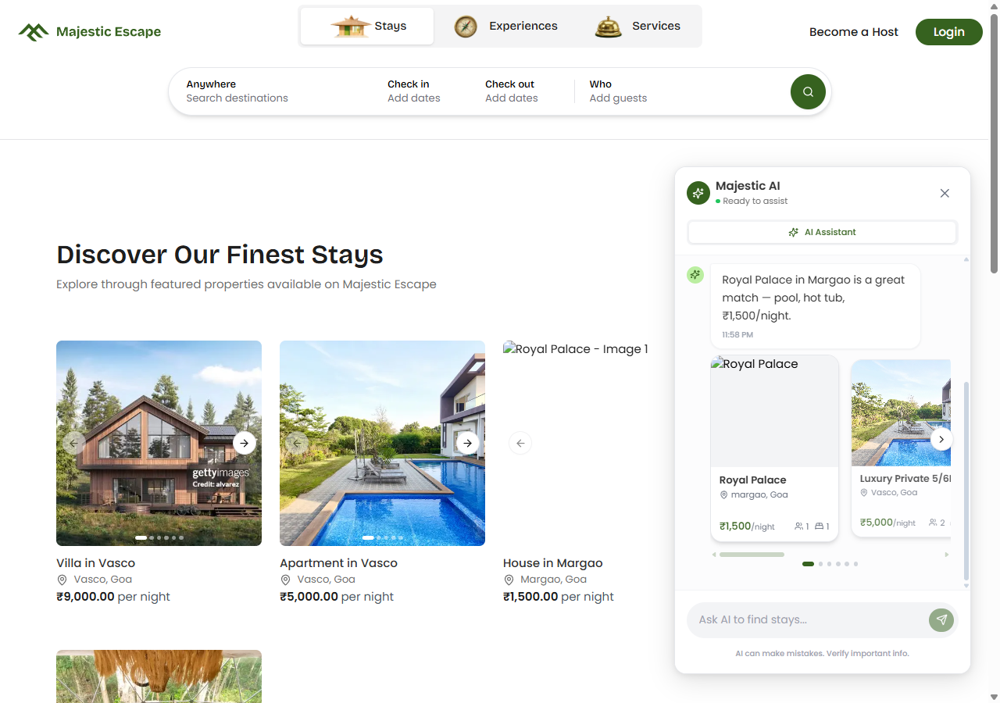
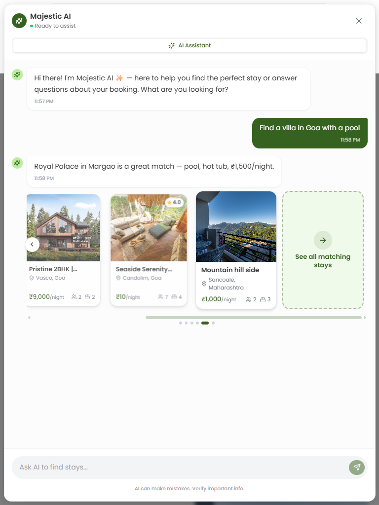
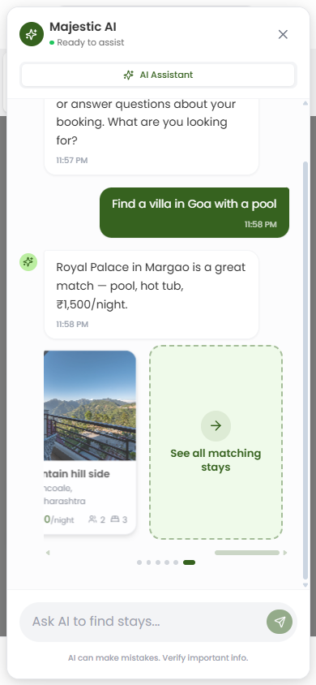
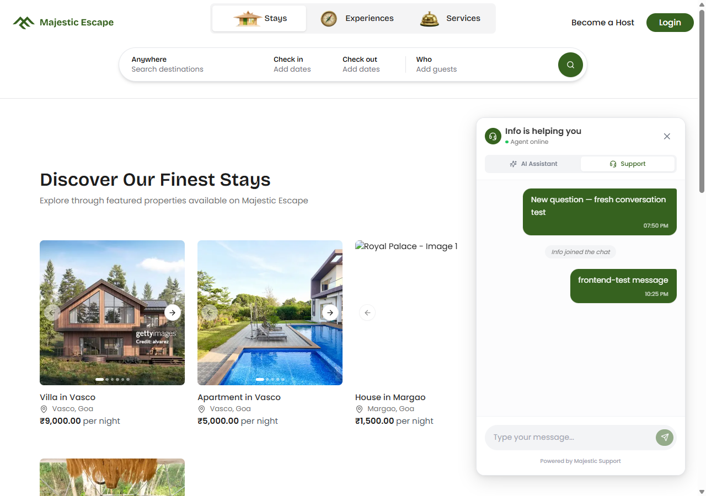
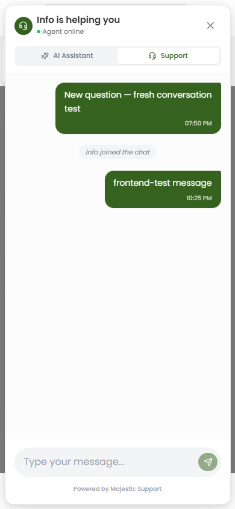
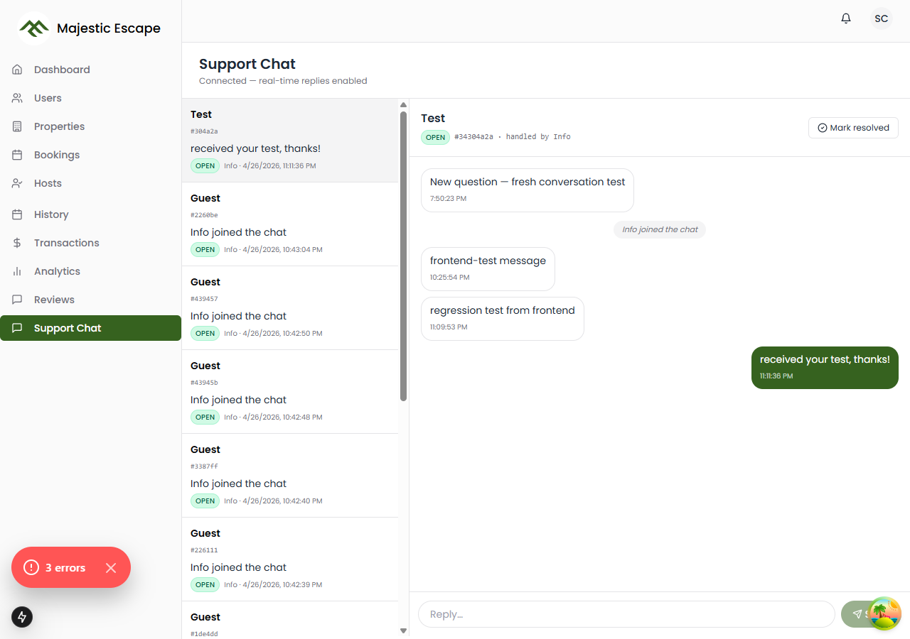
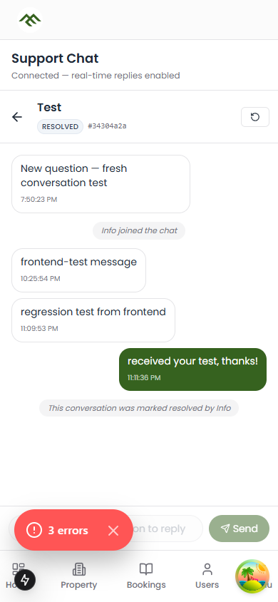
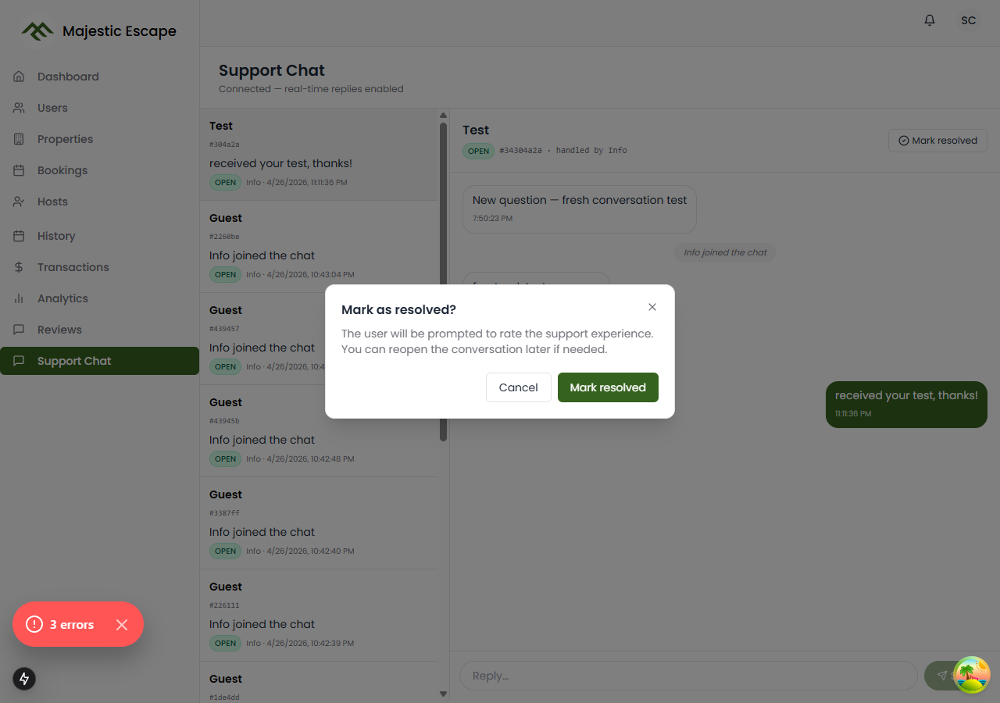

# Majestic Escape — RAG AI Chat Widget

A standalone Next.js 15 service that powers Majestic Escape's RAG chatbot and real-time
user↔admin support chat. Deployable to Railway as a single always-on container.

> **New here?** Start with [`ARCHITECTURE.md`](ARCHITECTURE.md) for a full developer-facing tour of the system. For shipping to production see [`RAILWAY_DEPLOYMENT.md`](RAILWAY_DEPLOYMENT.md). The notes below are a quick reference; the two long docs are the source of truth.

## Screenshots

### AI Assistant — what guests see on majesticescape.in

| Desktop (1280×900) | Tablet (768×1024) | Mobile (390×844) |
|---|---|---|
|  |  |  |

Streaming reply with a horizontal snap-carousel of portrait property cards (centred card scales up, neighbours fade). Touch-swipe on mobile, drag + chevron buttons on desktop, dot indicator below. Up to 8 most-relevant matches per query plus a trailing "See all matching stays" tile.

### Real-time Support chat — what guests see when they switch tabs

| Desktop conversation restored on reload | Mobile real-time roundtrip |
|---|---|
|  |  |

Full conversation history (live + immutable archive) restored from the server, system messages rendered as italic centred chips, "Info is helping you" header once an admin is assigned.

### Admin reply console — runs on admin.majesticescape.in/dashboard/support-chat

| Desktop two-pane (with status pills + full history) | Mobile single-pane with back arrow | Custom Mark-resolved modal |
|---|---|---|
|  |  |  |

OPEN / PENDING / RESOLVED status pills colour-coded; mobile collapses the conversation list and shows a back arrow on the active panel; native `confirm()` and `alert()` are replaced by a branded modal + toast for consistency.

## What this service does

1. **AI chat (`/api/chat`)** — Streams answers from Gemini 2.0 Flash (with Groq + xAI fallbacks
   on quota errors). RAG against the `listingproperties` MongoDB Atlas Vector Search index;
   booking-aware filtering against the `bookings` collection. An intent gate
   (`shouldUseRag()`) skips RAG for greetings, policy questions, booking
   management, and meta turns — those get short conversational replies with
   no carousel. See `ARCHITECTURE.md` §Operational guards.
2. **Embedding maintenance** — A long-lived MongoDB Change Streams worker watches
   `listingproperties` for inserts/updates/deletes and re-embeds within ~1s. A
   `runCatchUpSync` job runs at boot to reconcile any missed changes.
3. **Real-time support chat (`/support` Socket.IO namespace)** — Persists user↔admin
   conversations to `support_chats` (live ring buffer) + `support_chats_archive`
   (immutable compliance log). Admin reply console lives in `admin.site` at
   `/dashboard/support-chat` — this service is backend-only. **Templated
   auto-acknowledgement** fires on the user's first message in a fresh
   conversation so they get an instant "we've got your message" reply even
   when no admin is online yet (no LLM, race-safe via atomic Mongo update,
   suppressed once an admin engages).
4. **Standalone embed bundle (`/embed/widget.js`)** — One self-contained JS file
   (~92 kB gzipped) that hosts the entire React + Tailwind chat UI inside a Shadow
   DOM. Consumer sites (e.g. `user.website`) integrate the chat with **one
   `<script>` tag** — every chat-only change ships from this repo without
   touching the consumer. See [`docs/EMBED_INTEGRATION.md`](docs/EMBED_INTEGRATION.md)
   if it exists, or the brief in [`ARCHITECTURE.md`](ARCHITECTURE.md#standalone-embed-bundle).
5. **Persistence + retention** — every AI exchange goes to `ai_chat_messages`
   (with the property-card array attached to model replies), and every support
   message goes to `support_chats_archive`, so reloads, sign-ins from a new
   device, and admin transcript exports all see the full history.

This service does **not** depend on `server.me` — it writes the `embedding` and
`embeddingUpdatedAt` fields to `listingproperties` via the raw MongoDB driver,
bypassing Mongoose entirely.

### Integrating the chat on a consumer site

```html
<!-- The bundle auto-mounts a <majestic-chat-widget> custom element -->
<script src="https://chat.majesticescape.in/embed/widget.js" defer></script>
```

Or, in a Next.js app:

```tsx
import Script from "next/script";
<Script src="https://chat.majesticescape.in/embed/widget.js" strategy="lazyOnload" />
```

The bundle reads the user's JWT from `localStorage` (same eTLD+1 partitioning),
auto-derives the API origin from the script's `src` attribute, and renders the
entire chat inside a Shadow DOM so it can never collide with the host page's
CSS. Set `ALLOWED_ORIGINS` on this service to your consumer site's origin so
cross-origin REST + Socket.IO calls aren't penalised by the rate-limit halving.

## Local development

```bash
cp .env.example .env.local      # then fill in real values
npm install
npm run dev
# → http://localhost:3003
```

Open `http://localhost:3003/api/health` to verify the service is up. The chat itself is exercised via `user.website` (port 3000) and `admin.site` (port 3001), which connect to this service.

## Deploy to Railway

See [`RAILWAY_DEPLOYMENT.md`](RAILWAY_DEPLOYMENT.md) for the full step-by-step guide. Short version:

1. Push this repo to a GitHub remote.
2. Create a new Railway project pointing at the repo.
3. Set the environment variables listed in [`.env.example`](.env.example) on your Railway service (Variables tab).
4. Railway runs `npm install && npm run build` and then `npm start`.
5. Healthcheck is at `/api/health`.

## Key files

- `server.ts` — boots Next.js + Socket.IO + workers
- `src/app/api/chat/route.ts` — RAG + booking-aware filtering
- `src/lib/embedder.ts` — Gemini embedding + raw MongoDB writes
- `src/lib/supportSocket.ts` — Socket.IO `/support` namespace
- `src/middleware.ts` — CORS + preflight for `/api/chat/*` (cross-origin embed)
- `src/embed/main.tsx` — custom-element + Shadow-DOM mount entry for the embed bundle
- `src/embed/ChatWidget.tsx`, `useChat.ts`, `useSupportChat.ts`, `utils.ts`, `types.ts`, `styles.css` — the React widget bundled into `/embed/widget.js`
- `vite.embed.config.ts` — Vite library build config (IIFE, single-file output to `public/embed/widget.js`)
- `src/workers/changeStream.ts` — real-time embedding updates
- `src/workers/catchUpSync.ts` — boot-time reconciliation

> The user-facing chat widget UI **now lives here** in `src/embed/`. Consumer
> sites load it via the `/embed/widget.js` bundle. The admin reply console lives
> in [`admin.site/src/app/dashboard/support-chat/`](../admin.site/src/app/dashboard/support-chat/).

## Operational notes

### Property lifecycle → indexing

The `listingproperties.status` enum is `incomplete → processing → active → inactive`.
The Change Stream worker handles every transition automatically:

- **Host creates a draft** (`status: "incomplete"`) — `insert` event fires; embedder
  is called but skips because `status !== "active"`. No vector entry written.
- **Host completes the form** (any `update`) — `update` event fires; embedder again
  skips while status is non-active.
- **Admin approves** (`status` flips to `"active"`) — `update` event has `status` in
  `updatedFields`; trigger fires; full embed is written. The property becomes
  searchable in the chatbot within ~1s.
- **Admin delists** (`status` flips to `"inactive"`) — `update` event triggers
  `embedAndSaveProperty`, which sees non-active status and unsets the embedding —
  the property silently disappears from chat results.
- **Property deleted** — `delete` event unsets embedding fields (no orphan vector).

No coordination with `server.me` is required for any of these.

### What gets indexed (per property)

The embedder text builder (`src/lib/embedder.ts → buildPropertyText`) includes:

- `title` (the listing's full custom name — same field shown on the stay detail page;
  the homepage card auto-renders `${propertyType} in ${city}` so we don't need a
  separate "short" name)
- `propertyType`, `placeType`
- Full address: `street`, `district`, `city`, `state`, `pincode`
- `basePrice` (per night)
- Capacity: `guests`, `bedrooms`, `beds`, `bathrooms`
- `bathroomTypes` breakdown (private / shared / dedicated counts)
- `amenities` (full list)
- `occupancy` flags (family-friendly, solo, group, etc.) — humanized prose
- `bookingType` (Instant Book / Flash Book / manual host approval)
- `cancellationType` (flexible / moderate / strict)
- `checkinTime`, `checkoutTime`
- House rules: `selectedRules` + `customRules`
- `averageRating`, `reviewCount`
- `discounts`
- Full `description`
- Up to 3 most recent approved review snippets (from the `reviews` collection)

`EMBED_TRIGGER_FIELDS` in the same file is kept in sync with this — any change to
those fields fires a Change Stream re-embed.

### Embedder versioning

`embedder.ts` exports `EMBEDDER_VERSION` (currently `2`). Each embedded document
also stores `embeddingVersion`. `runCatchUpSync` re-embeds any active property whose
stored version is older. Bump the constant whenever you change the prose format and
restart the service to migrate everyone.

### Where the chat widget renders

The customer-facing widget is rendered by `user.website` — see [`user.website/src/components/ai-chat/ChatWidget.tsx`](../user.website/src/components/ai-chat/ChatWidget.tsx). Its `HIDE_PATH_PREFIXES` controls which user.website routes the widget appears on (it hides on auth, checkout, host dashboard, and existing messaging surfaces).

This service is backend-only — it does not render the widget anywhere.

### Public surface (HTTP)

| Method | Path | Purpose | Auth |
|---|---|---|---|
| POST | `/api/chat` | RAG chat (SSE stream) | Optional JWT — higher rate limit when present |
| GET  | `/api/chat/history` | Restore prior AI exchanges (text + property cards) | JWT or `?guestSessionId=` |
| GET  | `/api/health` | Liveness + db + change-stream status | Public |
| GET  | `/api/support/conversations/:id/transcript[?format=text|json]` | Export full conversation including archived messages | Owner JWT, owner `guestSessionId`, or admin |
| DELETE | `/api/admin/conversations/:id` | Delete a conversation + its archive (audit row written) | Admin JWT |
| POST | `/api/admin/embed-all` | Run `runCatchUpSync` for every active property (idempotent) | Admin JWT |
| POST | `/api/admin/embed/:id` | Re-embed one property | Admin JWT |

### Public surface (Socket.IO `/support` namespace)

See [`ARCHITECTURE.md` §5](ARCHITECTURE.md) for the full event reference. Headline events:

- `support:joined` — initial state on connect (history, status, rating)
- `support:message` — bidirectional, real-time
- `support:fetch-history` / `support:history` — admin or owner replays the immutable archive
- `support:assign` / `support:resolve` / `support:reopen` — admin lifecycle, each writes a `support_audit` row

Admin auth is by JWT — anyone whose `userId` or `email` is in `ADMIN_USER_IDS` / `ADMIN_EMAILS`, or whose JWT carries `role: "admin"` / `admin: 1`.

### Health

`GET /api/health` returns:

```json
{ "ok": true, "db": true, "changeStream": { "isRunning": true, "lastEventTs": "..." } }
```

Use as Railway healthcheck.

